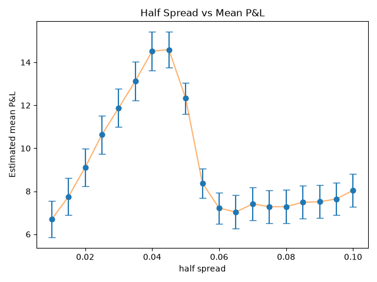
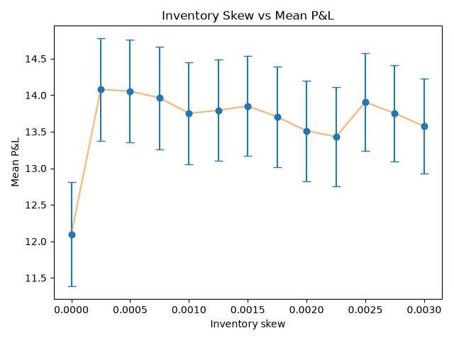
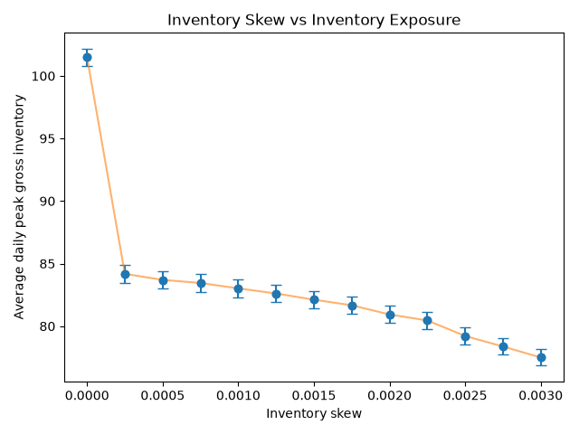
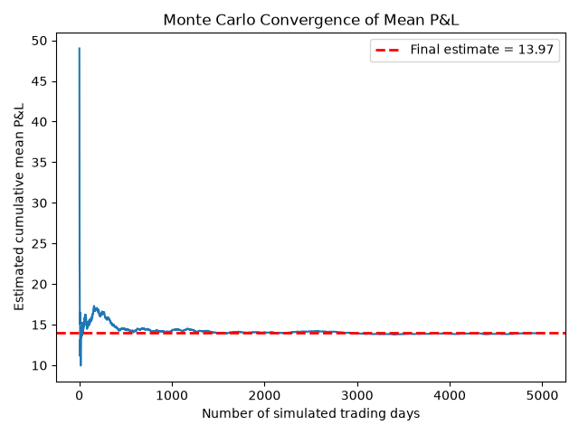

# Binary Options Market-Making Simulator

A Python simulation of a competitive binary-options market-making environment, inspired by a virtual quantitative trading challenge.

The project combines probability, statistical estimation, market-making mechanics, inventory and capital risk management, and Monte Carlo simulation to investigate how quoting parameters affect profitability and risk.

## Overview

The simulator models two correlated underlying assets, **Ajar** and **Theriodic**, and a collection of binary options written on their terminal values.

A market maker must:

1. Estimate the underlying market parameters from historical observations.
2. Calculate theoretical option values.
3. Quote bid and ask prices to incoming RFQs.
4. Decide whether to accept fill-or-kill (FOK) orders.
5. Compete with another market maker for order flow.
6. Manage inventory, position limits and capital.
7. Settle positions against simulated terminal asset values.
8. Evaluate strategy performance using repeated Monte Carlo simulations.

The market maker does not directly observe the true parameters used by the simulator. Instead, it estimates them from generated market history.

---

## Features

- Bivariate-normal model for correlated asset outcomes
- Statistical estimation of means, volatilities, and correlation
- Analytical pricing of several binary-option types
- Two-sided RFQ quoting
- Fill-or-kill order handling
- Competitive order allocation between two market makers
- Informed and uninformed customer flow
- Inventory-adjusted reservation prices
- Per-option position limits
- Capital-aware risk controls
- Worst-case settlement equity checks
- Multi-option inventory management
- Terminal settlement and P&L calculation
- Monte Carlo strategy evaluation
- Parameter sweeps with 95% confidence intervals
- Automated unit testing with `pytest`

---

# Mathematical Model

## Joint Asset Distribution

Terminal values of Ajar and Theriodic are modelled jointly as

$$
\begin{pmatrix}
A \\
T
\end{pmatrix}
\sim
N_2
\left(
\begin{pmatrix}
\mu_A \\
\mu_T
\end{pmatrix},
\begin{pmatrix}
\sigma_A^2 & \rho\sigma_A\sigma_T \\
\rho\sigma_A\sigma_T & \sigma_T^2
\end{pmatrix}
\right).
$$

The covariance between the two assets is therefore

$$
\operatorname{Cov}(A,T) = \rho \sigma_A \sigma_T
$$

Historical observations are generated from this distribution and stored in a
`MarketHistory`.

The market maker estimates

$$
\hat\mu_A,\quad
\hat\mu_T,\quad
\hat\sigma_A,\quad
\hat\sigma_T,\quad
\hat\rho
$$

using the simulated observations.

This creates a distinction between the **true market parameters**, which are known only by the simulator, and the **estimated parameters**, which are available to the trading strategy.

---

# Binary Option Pricing

Each contract pays either 1 or 0 at expiry. Its theoretical value is therefore
the probability of the event occurring under the estimated distribution.

## Strike Options

For an Ajar option paying

$$
1_{\{A>K\}},
$$

the theoretical price is

$$
V = P(A>K) =
1-\Phi\left(
\frac{K-\mu_A}{\sigma_A}
\right)
$$

where $\Phi$ is the standard normal CDF.

The same calculation is used for Theriodic strike options.

## Relative-Value Option

The simulator also includes a contract paying

$$
1_{\{A>T\}}.
$$

Define

$$
D=A-T.
$$

Because a linear combination of jointly normal random variables is normal,

$$
D
\sim
N
\left(
\mu_A-\mu_T,
\sigma_D^2
\right),
$$

where

$$
\sigma_D^2 = \sigma_A^2 + \sigma_T^2 - 2\rho\sigma_A\sigma_T.
$$

Therefore,

$$
P(A>T) = P(D>0) = 1-\Phi\left(
\frac{-(\mu_A-\mu_T)}
{\sigma_D}
\right)
$$

---

# Market-Making Strategy

## Reservation Price

The market maker first calculates the theoretical fair value $V$.

It then adjusts this value according to its current inventory:

$$
R = V - \lambda I,
$$

where

- $R$ is the inventory-adjusted reservation price,
- $I$ is the current position,
- $\lambda$ is the inventory-skew parameter.

Quotes are placed around the reservation price:

$$
\text{bid}=R-h,
\qquad
\text{ask}=R+h,
$$

where $h$ is the half-spread.

If the market maker is long $(I>0)$, the reservation price falls. This lowers
both quotes, discouraging additional purchases while making it easier to sell
existing inventory.

If the market maker is short, the opposite adjustment occurs.

---

# Order Flow

## RFQs

For an RFQ, the market maker returns

$$
(\text{bid},\text{bid size},\text{ask},\text{ask size}).
$$

If the customer wants to buy, they trade against the market maker's ask.
If the customer wants to sell, they trade against the market maker's bid.

The simulator contains a competing market maker. Customer orders are allocated
according to the most competitive executable quote, with ties resolved
symmetrically.

## Fill-or-Kill Orders

FOK orders specify a side, price and quantity.

Unlike an RFQ, the order must be filled completely or rejected.

The market maker accepts an FOK only if:

- the offered price is sufficiently favourable,
- the entire quantity respects the position limit,
- the resulting position remains within the capital constraint.

Both market makers independently evaluate incoming FOK orders.

---

# Capital and Risk Management

A binary option has payoff in

$$
\{0,1\}.
$$

A long position has worst-case terminal payoff 0, while a short position of
$q$ contracts may create a liability of $q$.

For each binary option with position $I_i$, the terminal settlement contribution is
$I_iY_i$, where $Y_i \in \{0,1\}$. Its worst-case value is therefore

$$
\min_{Y_i\in\{0,1\}} I_iY_i = \min(I_i,0).
$$

The simulator uses the conservative portfolio bound

$$
\sum_i \min(I_i,0).
$$

The simulator calculates worst-case equity as

$$
E_{\text{worst}} = C_0 + C + \sum_i\min(I_i,0),
$$

where

- $C_0$ is starting capital,
- $C$ is accumulated trading cash,
- $I_i$ is inventory in option \(i\).

Before processing a proposed trade, the simulator calculates the resulting
projected worst-case equity.

A trade is rejected if

$$
E_{\text{worst}} < 0
$$

or if it would violate the per-option position limit.

The simulator also records **daily peak gross inventory**

$$
G_{\max} = \max_t \sum_i |I_i(t)|
$$

which is used as a measure of inventory exposure.

---

# Competitive Simulation

Each simulated trading day consists of:

- historical observations used for parameter estimation,
- a sequence of RFQ and FOK order opportunities,
- competition between two market makers,
- informed and uninformed customer flow,
- inventory and capital management,
- a final draw of $(A,T)$,
- settlement of all outstanding binary-option positions.

The benchmark market maker uses the same estimated market information but does
not use the same inventory-skew strategy, allowing the effect of inventory
management to be studied.

Random seeds are used to make experiments reproducible and to allow strategies
to be compared under identical simulated market conditions.

---

# Monte Carlo Analysis

Strategy performance is evaluated over thousands of independently simulated
trading days.

For daily P&Ls

$$
X_1,\ldots,X_N,
$$

the Monte Carlo estimate of expected P&L is

$$
\hat{\mu}_N = \frac{1}{N}\sum_{i=1}^{N} X_i
$$
For parameter sweeps, approximate 95% confidence intervals are calculated as

$$
\hat\mu
\pm
1.96\frac{s}{\sqrt N},
$$

where $s$ is the sample standard deviation of simulated daily P&L.

---

# Experimental Results

## Half-Spread



The simulations display a clear interior optimum.

Mean P&L rises strongly as the half-spread increases from approximately
$0.01$, reaching around $14.5$ for half-spreads near $0.04$ – $0.045$.

Beyond approximately $0.05$, performance falls sharply. At even wider
spreads, mean P&L stabilises at substantially lower levels.

This demonstrates the trade-off faced by a market maker:

$$
\text{narrow spread}
\rightarrow
\text{more flow but less margin / greater adverse-selection exposure},
$$

while

$$
\text{wide spread}
\rightarrow
\text{larger potential margin but fewer executions}.
$$

The simulation therefore produces a non-trivial spread-selection problem rather
than simply rewarding wider quotes.

---

## Inventory Skew and Profitability



Introducing even a small positive inventory skew produces a substantial
improvement relative to the zero-skew strategy.

In this experiment:

- zero inventory skew produced mean P&L of roughly $12.1$,
- small positive skew values produced mean P&Ls around $14$,
- increasing skew further did not produce a correspondingly large additional
  increase in profitability.

The 95% confidence intervals also show that differences among many of the
positive-skew settings are considerably smaller than the improvement obtained
from moving away from zero skew.

This suggests that the main benefit comes from introducing inventory-aware
quoting itself, rather than precisely optimising $\lambda$ to many decimal
places.

---

## Inventory Skew and Risk



Inventory skew has an especially clear effect on inventory exposure.

With no inventory adjustment, average daily peak gross inventory is slightly
above $100$ contracts.

Introducing a small positive skew reduces this to roughly $84$ contracts.

As the skew parameter is increased further, exposure continues to decline,
reaching approximately $77–78$ contracts at

$
\lambda = 0.003.
$

This demonstrates the intended risk-management effect of the reservation-price
adjustment:

$$
\lambda \uparrow
\quad\Longrightarrow\quad
\text{stronger pressure to mean-revert inventory}
\quad\Longrightarrow\quad
G_{\max}\downarrow.
$$

The P&L and exposure experiments together therefore show a risk-return
trade-off: modest inventory skew can reduce inventory substantially without
sacrificing simulated profitability.

---

## Monte Carlo Convergence



The running Monte Carlo estimate is

$$
\hat\mu_n
=
\frac{1}{n}
\sum_{i=1}^{n}X_i.
$$

Initially the estimate is highly unstable because it depends on only a small
number of simulated trading days.

As $n$ increases, individual observations have progressively less influence
and the estimate stabilises.

Across **5,000 simulated trading days**, the experiment shown above converges
to a mean P&L estimate of approximately

$$
\boxed{13.97}.
$$

This convergence experiment provides a check that the reported strategy
performance is not being inferred from only a small number of favourable
simulations.

---

# Project Structure

```text
binary-options-market-maker/
├── README.md
├── requirements.txt
├── .gitignore
├── pytest.ini
│
├── main.py
├── market.py
├── pricing.py
├── estimation.py
├── exchange.py
├── bots.py
├── simulator.py
├── analysis.py
│
├── figures/
│   ├── half_spread_mean_P&L.png
│   ├── inventory_skew_pnl.png
│   ├── inventory_skew_exposure.png
│   └── monte_carlo_convergence.png
│
└── tests/
    ├── test_pricing.py
    ├── test_exchange.py
    ├── test_market_maker.py
    └── test_simulator.py
```
# Running the Project

Install the required dependencies:

```bash
pip install -r requirements.txt
# Running the Project
```
To run a single example trading day:

```bash
python main.py
```
To run the Monte Carlo analysis and generate the figures:

```bash
python analysis.py
```

To run the automated tests:

```bash
python -m pytest
```
# Testing

The project includes automated tests covering:

- analytical binary-option pricing,
- RFQ execution mechanics,
- FOK acceptance and rejection,
- cash and inventory accounting,
- position and capital limits,
- option settlement,
- inventory-skew behaviour,
- end-to-end simulator execution.

The tests are intended both to validate individual components and to protect
against regressions when the trading logic is modified.

# Model Assumptions and Limitations

The simulator is designed as an interpretable research and educational model
rather than a production trading system. Several simplifying assumptions are
made deliberately.

- **One-period market model.** Ajar and Theriodic are modelled through their
  terminal values rather than continuous intraday price paths. The simulator
  therefore focuses on quoting, execution and inventory management rather than
  high-frequency price dynamics.

- **Bivariate normal terminal distribution.** Terminal asset values are assumed
  to follow a joint normal distribution with constant means, volatilities and
  correlation. This makes analytical binary-option pricing possible, but does
  not capture features such as skewed or heavy-tailed returns, volatility
  clustering or changing correlations.

- **Parameter estimation from simulated history.** The market maker estimates
  means, standard deviations and correlation from observations generated by
  the same underlying model. In a real market, model misspecification and
  structural regime changes would make estimation more difficult.

- **Simplified order flow.** Customer RFQs and FOK orders are synthetically
  generated. Informed and uninformed traders are represented using simplified
  behavioural rules rather than being calibrated to real order-flow data.

- **Simplified competition.** Market makers compete primarily through quoted
  price and executable size. The simulation does not model latency, exchange
  queue priority, order-book depth, market impact or strategic order
  cancellation.

- **Simplified transaction economics.** Exchange fees, transaction costs,
  funding costs and interest rates are omitted. Binary contracts therefore
  have values determined directly by the modelled event probabilities.

- **Inventory-based risk management.** Risk is controlled using per-option
  position limits, inventory skew and a capital constraint rather than a full
  portfolio risk model such as VaR, expected shortfall or scenario-based Greeks.

- **Conservative capital bound.** For each binary option, the simulator uses
  the worst-case settlement contribution

  $$
  \min(I_i,0),
  $$

  and sums these across positions. Because different options depend on the same
  underlying outcomes, all individual worst cases may not be achievable
  simultaneously. The resulting portfolio capital requirement is therefore a
  conservative bound rather than an exact joint worst-case optimisation.

- **Static strategy parameters within a run.** Parameters such as half-spread
  and inventory skew are fixed during each experiment. The market maker does
  not currently learn or adapt these parameters dynamically during the trading
  day.

- **Simulation-dependent results.** Reported P&L and inventory results are
  conditional on the assumed market model, order-flow rules, competitor and
  chosen simulation parameters. They should therefore be interpreted as
  comparisons within the simulated environment rather than forecasts of
  real-world trading profitability.

## Possible Extensions

Natural extensions include:

- time-varying asset prices and intraday volatility,
- non-Gaussian or regime-switching terminal distributions,
- calibration to empirical order-flow data,
- adaptive spread and inventory-skew selection,
- richer competing market-maker strategies,
- exact joint portfolio stress testing,
- transaction costs and exchange fees,
- order-book depth, queue priority and latency.

# Disclaimer

This project is an independent educational reconstruction inspired by a
virtual market-making challenge.

It does not reproduce proprietary challenge code, datasets or implementation
details. The market dynamics, pricing model and trading environment used here
were independently constructed for educational and quantitative research
purposes.